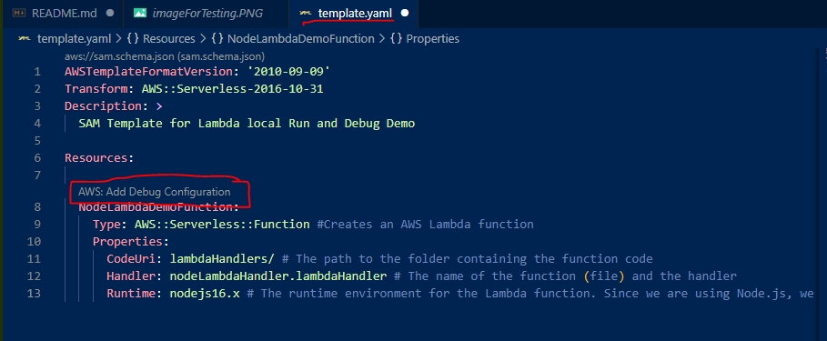

# Run and Debug Lambdas locally with SAM Demo Project

## About The Project
It contains simple Lambda code, the prerequisites and steps to run and debug a Lambda function locally with SAM CLI.

The example Lambda function is in Node but it can be easily adapted to other languages: Java, Python, Go, etc.

## Prerequisites
You need:
- Docker Desktop: https://www.docker.com/
- SAM CLI: follow the steps here to install it: https://docs.aws.amazon.com/serverless-application-model/latest/developerguide/serverless-sam-cli-install.html
- Visual Studio Code: https://code.visualstudio.com/
  - I highly suggest it since this tutorial is directly using some of it's features, although you could do it with other editor tools.

## Context, what is SAM?

With SAM "Serverless Application Model" you can express AWS functions, APIs, databases, and event source mappings in a YAML file.

It is really useful to define your serverless infrastructure in a clear and replicable way.

At deployment, SAM syntax is transformed into AWS CloudFormation syntax. (SAM is an extension of Cloud Formation)

And the most important feature for this tutorial, it lets you run and debug your Lambdas locally (and all your serverless application).

## Explanation of the example and its configurations
1. We have defined a really simple Node Lambda at lambdaHandlers/nodeLambdaHandler.js

1. We then need to specify the event(the input) that will be passed to the Lambda when we run it. At lambdaHandlers/node_lambda_event.js

1. Finally, at the template.yaml file we define the actual Lambda resource
``` YAML
  NodeLambdaDemoFunction:
    
    Type: AWS::Serverless::Function #Creates an AWS Lambda function
    Properties: 
      CodeUri: lambdaHandlers/ # The path to the folder containing the function code
      Handler: nodeLambdaHandler.lambdaHandler # The name of the function (file) and the handler
      Runtime: nodejs16.x # The runtime environment for the Lambda function. Since we are using Node.js, we use nodejs16.x but if the lambda Hanlder was written for example in Java, we would define here java11 or any other Java version
```
## How to RUN a Lambda Locally
1. Open Docker Desktop and make sure it is running.
1. Open a terminal, navigate to the root of the project and run the following:
``` 
sam local invoke -e ./lambdaHandlers/node_lambda_event.json NodeLambdaDemoFunction
```
It should return among other things:
```
"lambda handler done!"
``` 

My output for example was:
```
START RequestId: 580a3523-20a7-4022-b953-3439309803b2 Version: $LATEST
END RequestId: 580a3523-20a7-4022-b953-3439309803b2
REPORT RequestId: 580a3523-20a7-4022-b953-3439309803b2  Init Duration: 0.30 ms  Duration: 93.43 ms      Billed Duration: 94 ms  Memory Size: 128 MB     Max Memory Used: 128 MB
"lambda handler done!"
```

## How to DEBUG a Lambda locally
The easiest way is to go to the template.yaml file and click on the following text "AWS: Add Debug Configuration", this will create a debug configuration


Furthermore, we will need to specify which is the input of the lambda, so in the same launch.json file we add the path to the event file: 
```
            "lambda": {
                "payload": {"path": "./lambdaHandlers/node_lambda_event.json"},
                "environmentVariables": {}
            } 
```
More information about the debug configuration can be found here: 
https://docs.aws.amazon.com/toolkit-for-vscode/latest/userguide/serverless-apps-run-debug-config-ref.html

Then to actually debug 
1. we will go to the "Run and Debug tab" in Visual Studio Code
1. Add the desired breakpoints in our Lambda Handler
1. Select the Debug Configuration we created, in this case "NodeLambdaDemoFunction" (Right next to the green arrow)
1. Click the Start Debugging button (the green arrow)


(It might not happen) but if the debugger stops in the following file, just click the "Continue" button


Finally we will be hitting our breakpoints and will be able to debug our Lambda function locally


## Run and Debug Lambdas written in other languages
The steps are (nearly) the same, just make sure to change the Runtime in the template.yaml file to the corresponding language.